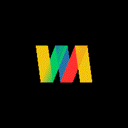

## WaveAct App
--- 

A PoC code for remote control with hand gestures.

Data collected from smartwatch accelometer are forwarded over the network to golang receiver server.

`server_keyboard.go` implements a receiver which interprets smartwatch data and converts is to gestures triggering specific keystrokes.
This allows to control PC, i.e. slideshow, with a swipe of a hand.

MIDI implementation in `server_midi_cc.go` allows to control music hardware/software through MIDI protocol. Accelerometer axes (x,y,z) can be bound to specific MIDI control channels which can be used to shape soud with hand rotation.

This project consists out of Garmin VivoActive 4S app together with golang receiver server.

##### Examples

##### Side notes
Depending on the android version of the garmin watch it might require a valid TLS certificate for receiver server.
Response latency depends on the network speed of client and server.

